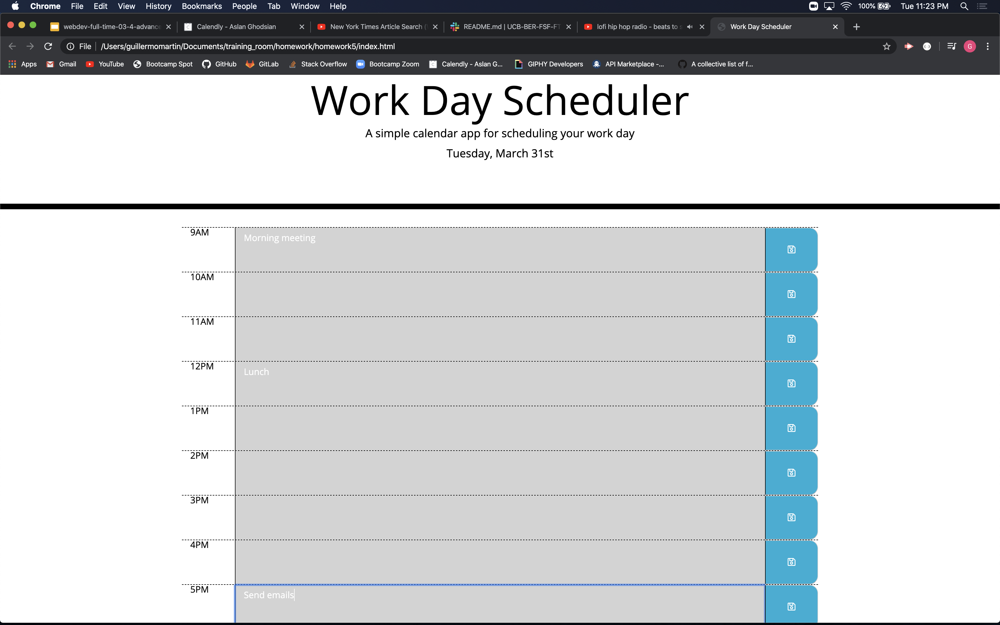

# Day Planner

 https://fanuelalem.github.io/hw_5/
 
## Description
The app allows a user to plan their workday by showing the user the current date and blocks of time.  The user can type their tasks in the textbox and save their tasks. The app uses moment.js to display the current date. Moment.js is also used to keep track of the current hour. Timeblocks that are past the current hour will be colored grey to indicate that particular time block is in the past.  The current timeblock will be colored red.  Future time blocks will be colored green. A user can type whatever they want in the textbox and when they press the save button, the text gets saved to local storage. If the user leaves the website and comes back, the information will still be available.  

## Technologies
* Languages, frameworks, various tools
    * HTML, JavaScript, jQuery, Bootstrap, moment.js  

## Challenges
* Your experience building this app
    * Overall, I had a difficult time building this app.  I often ran into issues where I would spend hours trying to research the problem and not make any progress.
* What was difficult
    * I had a hard time trying to get the text from the textarea, properly render it from local storage to the textarea, and coming up with the values to use for time comparisons.
* What did you learn
    * I learned how to better use arrays and objects, what .prev() does in jQuery, and how to retrieve data from local storage and render it more efficiently.
* How did you go about solving a problem
    * I would try and Google the particular problem I was having, attend office hours, and ask for help.

## Screenshot

